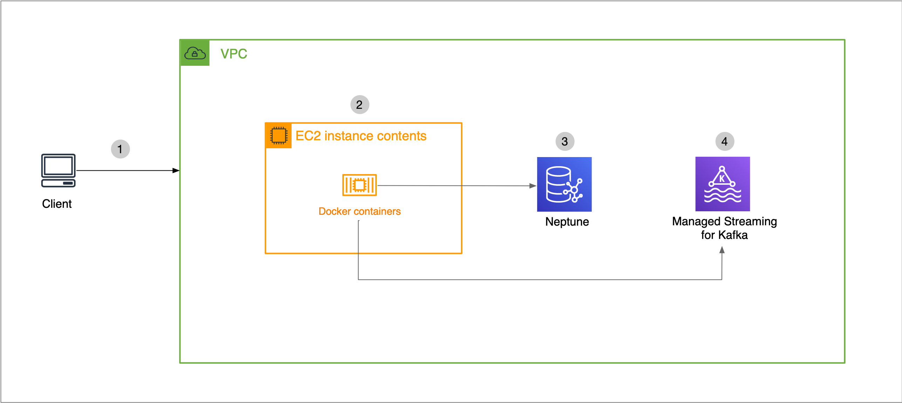
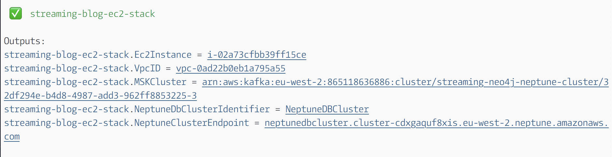
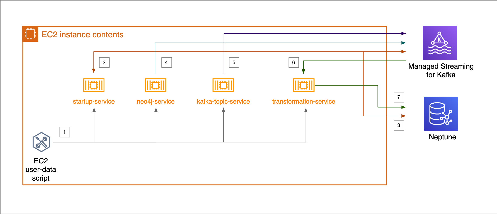
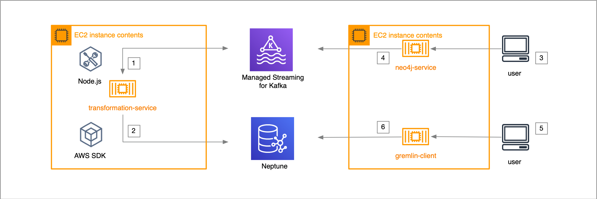

# Architecture



# Prerequisites

- Install
  [Node.js and npm](https://docs.npmjs.com/downloading-and-installing-node-js-and-npm)
- Install [Git](https://git-scm.com/book/en/v2/Getting-Started-Installing-Git)
- [Install](https://docs.aws.amazon.com/cli/latest/userguide/cli-chap-install.html)
  and
  [Configure](https://docs.aws.amazon.com/cli/latest/userguide/cli-chap-configure.html)
  [AWS CLI](https://aws.amazon.com/cli/)
- The [IAM user](https://docs.aws.amazon.com/IAM/latest/UserGuide/id.html)
  configured in the AWS profile must have the privileges to provision the
  following resources. Please note, while working with AWS acounts, IAM users
  and policies always follow
  [IAM best practices](https://docs.aws.amazon.com/IAM/latest/UserGuide/best-practices.html):
  - Amazon VPC and Subnets
  - Amazon EC2 instance
  - Amazon S3 bucket
  - Amazon S3 Gateway VPC Endpoint
  - An Amazon Neptune cluster
- Install
  [AWS CDK](https://docs.aws.amazon.com/cdk/latest/guide/getting_started.html)

# Launching the app

To setup the app, run the following commands:

## Download code from GitHub

```
git clone https://github.com/sahays/streaming-neo4j-msk-neptune
cd streaming-neo4j-msk-neptune/bootstrapper
```

## Review configuration file

- Verify the app specific configuration saved in `bootstrapper/cdk.json` to
  ensure you have the right values for your environment
  - (Required) replace `<your-key-pair-name>` with your own
    [EC2 key pair](https://docs.aws.amazon.com/AWSEC2/latest/WindowsGuide/ec2-key-pairs.html#having-ec2-create-your-key-pair)
    name e.g. `my-us-west-2-key-pair`
  - (Required) replace `<provide-your-ip>` with your current IP address e.g.
    8.8.8.8/32 [Know your IP address](https://www.whatsmyip.org/)

```
{
  "app": "node bin/bootstrapper.js",
  "context": {
    "VPC_CIDR": "192.168.0.0/16",
    "EC2_CLASS": "t3a",
    "EC2_TYPE": "xlarge",
    "EC2_KEY_PAIR": "<your-key-pair-name>",
    "SG_FROM_IP": "<provide-your-ip>",
    "KAFKA_BROKER_INSTANCE_TYPE": "kafka.m5.large",
    "NEPTUNE_DB_INSTANCE_TYPE": "db.r5.large",
    "SOURCE_TOPIC_NODES": "Person{*};Movie{*}",
    "SOURCE_TOPIC_RELATIONSHIPS": "ACTED_IN{*}",
    "KAFKA_TOPIC": "graphstream"
  }
}

```

## Deploy

After making changing to the file, run the following commands to launch:

```
npm install
npm run deploy
```

After successful run of the program (it takes about 10 minutes to complete),
you'll see an output similar to the following:


| Output                      | Purpose                                        |
| --------------------------- | ---------------------------------------------- |
| .VpcID                      | Amazon VPC Id that contains all the resources  |
| .MSKCluster                 | Amazon Managed Service for Kafka cluster ARN   |
| .EC2Instance                | Amazon EC2 instance Id                         |
| .NeptuneDbClusterIdentifier | Cluster name for the Amazon Neptune DB cluster |
| .NeptuneClusterEndpoint     | Endpoint of the Amazon Neptune DB cluster      |

## Detailed architecture



## Post deploy steps

SSH into the Amazon EC2 instances created by the app. To see a list of all
running containers run the following command:

```
docker container ls -a
```

You should be able to see the following 3 docker container services:

| Service name           | Purpose                                                                                      | Status  |
| ---------------------- | -------------------------------------------------------------------------------------------- | ------- |
| transformation-service | runs the transformation engine that transforms Neo4j data to Amazon Neptune data format      | Running |
| neo4j-service          | runs the Neo4j graph database version 3.5.6                                                  | Running |
| startup-service        | runs the startup docker that fetches endpoint information from Amazon Neptune and Amazon MSK | Stopped |
| kafka-topic-service    | creates a new topic in Amazon MSK                                                            | Stopped |

If you want to see logs for a service, run the following command:

```
docker container logs <service-name>
```

## Execute cypher scripts

To execute cypher scripts you need to enter the `neo4j-service` container using
the following command

```
docker container exec -it neo4j-service cypher-shell
```

then execute a simple create command like the following

```
CREATE (TheMatrix:Movie {title:'The Matrix', released:1999, tagline:'Welcome to the Real World'});
CREATE (Keanu:Person {name:'Keanu Reeves', born:1964});
CREATE (Keanu)-[:ACTED_IN {roles:['Neo']}]->(TheMatrix);
```

Next, see the `transformation-service` logs by executing

```
docker container logs transformation-service
```

you should see an output similar to the following:

```
processing node {
  id: '0',
  before: null,
  after: {
    properties: {
      tagline: 'Welcome to the Real World',
      title: 'The Matrix',
      released: 1999
    },
    labels: [ 'Movie' ]
  },
  type: 'node'
}
inserted 0 {
  properties: {
    tagline: 'Welcome to the Real World',
    title: 'The Matrix',
    released: 1999
  },
  labels: [ 'Movie' ]
}
Movie
processing node {
  id: '20',
  before: null,
  after: {
    properties: { born: 1964, name: 'Keanu Reeves' },
    labels: [ 'Person' ]
  },
  type: 'node'
}
inserted 20 {
  properties: { born: 1964, name: 'Keanu Reeves' },
  labels: [ 'Person' ]
}
Person
```

Finally, to confirm that Amazon Neptune has been updated with streaming data run
the following commands in order

```
docker run -it -e NEPTUNE_HOST --entrypoint /replace-host.sh sanjeets/neptune-gremlinc-345
```

```
:remote console
```

```
g.V().count()
```

## Query architecture

The following code snippet shows the docker-compose environment section of the
Neo4j service. This allows Neo4j to become a source of events for Kafka
connector.

```
NEO4J_AUTH: none
NEO4J_dbms_logs_debug_level: DEBUG
# KAFKA related configuration
NEO4J_kafka_zookeeper_connect: ${ZOOKEEPER_CONNECT}
NEO4J_kafka_bootstrap_servers: ${BOOTSTRAP_SERVERS}
NEO4J_kafka_security_protocol: SSL
NEO4J_kafka_ssl_truststore_location: /var/lib/neo4j/temp/kafka.client.truststore.jks
NEO4J_kafka_acks: 1
NEO4J_kafka_num_partitions: 1
NEO4J_kafka_retries: 2
# streams
NEO4J_streams_procedures_enabled: "true"
NEO4J_streams_source_enabled: "true"
NEO4J_streams_source_topic_nodes_neo4j: Person{*};Movie{*}
NEO4J_streams_source_topic_relationships_neo4j: ACTED_IN{*}
NEO4J_streams_source_schema_polling_interval: 10000
# other
NEO4J_apoc_trigger_enabled: "true"
NEO4J_dbms_jvm_additional: -Djavax.net.debug=ssl:handshake
NEO4J_dbms_security_procedures_whitelist: apoc.*,streams.*
NEO4J_dbms_security_procedures_unrestricted: apoc.*,streams.*
```

The following code snippet shows the nodes and relationships that are configured
to be the source of events for the Kafka connector. This ensures that whenever
you perform CTUD operations on these nodes and relationships Neo4j will send
changed data to Kafka. The `transformation-service` on the other had will
recieve these data changes and will update Amazon Neptune

```
NEO4J_streams_source_topic_nodes_neo4j: Person{*};Movie{*}
NEO4J_streams_source_topic_relationships_neo4j: ACTED_IN{*}
```

The following architecture shows how `neo4j-service` works with
`transformation-service` and Amazon Managed Service for Kafka.



# Cleaning up

To cleanup AWS resources you need to run the following command:

```
npm run destroy
```
